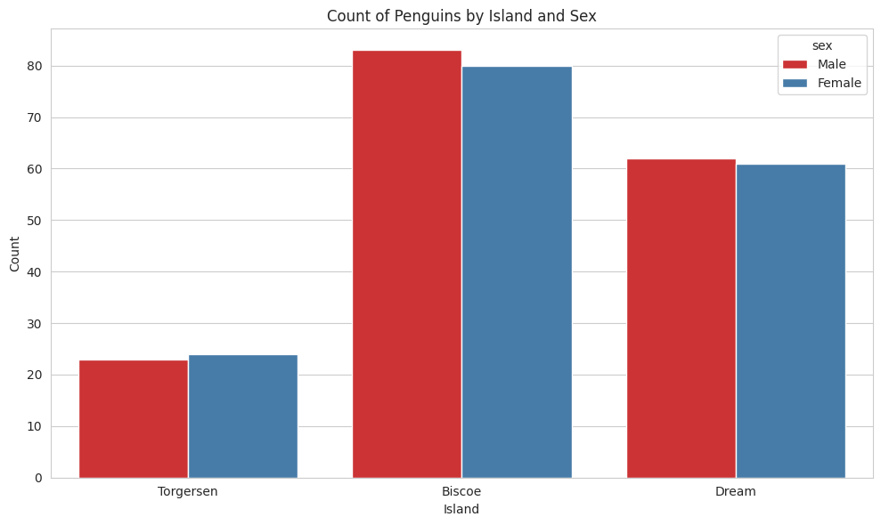

# 펭귄 데이터셋 분석 보고서

생성 날짜: 2025-12-23 13:02:37

---

## 1. 데이터셋 개요

- 총 관측치: 333개

- 특성 개수: 7개

- 특성 목록: species, island, bill_length_mm, bill_depth_mm, flipper_length_mm, body_mass_g, sex

### 데이터셋 인사이트
- 세 가지 펭귄 종(Adelie, Gentoo, Chinstrap)의 신체 특성 데이터를 포함
- 결측치 제거 후 333개의 완전한 관측치로 분석 진행
- 남성(168개) 및 여성(165개) 개체수가 거의 균형을 이루고 있음
- 세 개의 섬(Biscoe, Dream, Torgersen)에서 수집된 데이터로 지역별 비교 가능

## 2. 기본 통계 분석

### 수치형 데이터 통계

|       |   bill_length_mm |   bill_depth_mm |   flipper_length_mm |   body_mass_g |
|:------|-----------------:|----------------:|--------------------:|--------------:|
| count |        333       |       333       |            333      |       333     |
| mean  |         43.9928  |        17.1649  |            200.967  |      4207.06  |
| std   |          5.46867 |         1.96924 |             14.0158 |       805.216 |
| min   |         32.1     |        13.1     |            172      |      2700     |
| 25%   |         39.5     |        15.6     |            190      |      3550     |
| 50%   |         44.5     |        17.3     |            197      |      4050     |
| 75%   |         48.6     |        18.7     |            213      |      4775     |
| max   |         59.6     |        21.5     |            231      |      6300     |

### 통계 분석 인사이트
- **부리 길이**: 평균 44.0mm, 범위 32.1-59.6mm → 32mm의 변동폭으로 종간 뚜렷한 차이
- **체질량**: 평균 4,207g, 표준편차 805g → 신체 크기의 개인차가 상당함
- **날개 길이**: 상대적으로 안정적 (std: 14.0) → 종별 신체 크기 분류에 유용
- **부리 깊이**: 가장 작은 변동 (std: 1.97) → 종 구분에 중요한 특성일 가능성

### 범주형 데이터 분포

#### 종(Species)

| species   |   count |
|:----------|--------:|
| Adelie    |     146 |
| Gentoo    |     119 |
| Chinstrap |      68 |

#### 성별(Sex)

| sex    |   count |
|:-------|--------:|
| Male   |     168 |
| Female |     165 |

#### 섬(Island)

| island    |   count |
|:----------|--------:|
| Biscoe    |     163 |
| Dream     |     123 |
| Torgersen |      47 |

### 범주형 데이터 인사이트
- **종 분포**: Adelie(43.8%) > Gentoo(35.7%) > Chinstrap(20.4%)
  - Adelie 종이 가장 많이 표본화됨
  - Chinstrap 종은 표본 크기가 작아 분석 시 주의 필요
- **성별 분포**: 남녀 비율이 거의 1:1로 균등함
- **섬별 분포**: Biscoe(48.9%) > Dream(36.9%) > Torgersen(14.1%)
  - 섬별로 펭귄 개체수가 상이함
  - Torgersen은 가장 작은 개체수로 특정 종의 자료 부족 가능성

## 3. 상관관계 분석

수치형 특성 간의 상관관계:

|                   |   bill_length_mm |   bill_depth_mm |   flipper_length_mm |   body_mass_g |
|:------------------|-----------------:|----------------:|--------------------:|--------------:|
| bill_length_mm    |         1        |       -0.228626 |            0.653096 |      0.589451 |
| bill_depth_mm     |        -0.228626 |        1        |           -0.577792 |     -0.472016 |
| flipper_length_mm |         0.653096 |       -0.577792 |            1        |      0.872979 |
| body_mass_g       |         0.589451 |       -0.472016 |            0.872979 |      1        |

### 상관관계 인사이트
**강한 양의 상관관계:**
- 날개 길이 ↔ 체질량 (r=0.87): 매우 강한 상관관계
  - 더 긴 날개를 가진 펭귄이 체질량이 더 크다
  - 신체 크기의 전반적인 일관성을 시사
- 부리 길이 ↔ 날개 길이 (r=0.65): 중간 수준의 양의 상관관계

**음의 상관관계:**
- 부리 길이 ↔ 부리 깊이 (r=-0.23): 약한 음의 상관관계
  - 부리가 길면 깊이는 상대적으로 작은 경향
  - 각 종의 독특한 부리 형태를 반영
- 부리 깊이 ↔ 체질량 (r=-0.47): 중간 수준의 음의 상관관계
  - 부리가 깊을수록 체질량은 작은 경향
  - **Adelie vs Gentoo 종의 뚜렷한 특성 차이**

## 4. 시각화 결과 및 분석

### 주요 발견 사항
1. **종별 특성의 명확한 분화**
   - 세 가지 종이 신체 특성에서 뚜렷하게 구분됨
   - Gentoo: 가장 크고 무거운 종
   - Adelie: 중간 크기의 종
   - Chinstrap: 상대적으로 작은 종

2. **성별 차이의 일관성**
   - 모든 종에서 수컷(Male)이 암컷(Female)보다 큼
   - 성차(Sexual Dimorphism)가 명확하게 나타남

3. **지역별 변이**
   - 섬별로 펭귄 종의 분포가 다름
   - 특정 종이 특정 섬에 집중분포

### 4. 시각화 결과

- **그래프 1: 부리 길이 vs 부리 깊이 (종별로 구분)**

  

- **그래프 2: 체질량 vs 부리 길이 (성별로 구분)**

  

- **그래프 3: 날개 길이 vs 체질량 (부리 길이로 색상 표시)**

  

### 4.2 히스토그램

- **그래프 4: 부리 길이 분포**

  

- **그래프 5: 부리 깊이 분포**

  

- **그래프 6: 날개 길이 분포**

  

- **그래프 7: 체질량 분포**

  

### 4.3 박스플롯

- **그래프 8: 종별 부리 길이 분포**

  

- **그래프 9: 종별 체질량 분포**

  

### 4.4 바이올린플롯

- **그래프 10: 성별 부리 길이 분포**

  

- **그래프 11: 종별/성별 체질량 분포**

  

### 4.5 히트맵

- **그래프 12: 상관관계 히트맵**

  

### 4.6 막대 그래프

- **그래프 13: 종별 개수**

  

- **그래프 14: 성별 개수**

  

- **그래프 15: 섬별 개수**

  

### 4.7 추가 시각화

- **그래프 16: 쌍플롯 (PairPlot)**

  

- **그래프 17: 종별/성별 카운트플롯**

  

- **그래프 18: 섬별/성별 카운트플롯**

  

### 시각화 해석
**산점도 분석:**
- 부리 길이와 깊이의 음의 관계가 종별로 다르게 나타남
- 체질량은 여러 신체 특성과 함께 증가하는 경향
- 색상 기울기는 변수 간의 복합적인 관계를 시각화

**분포 분석:**
- 히스토그램: 대부분의 신체 특성이 다봉분포(Multimodal)를 보임 → 종의 다양성 반영
- 박스플롯: Gentoo 종이 다른 종들과 명확히 구분됨
- 바이올린플롯: 종과 성별의 이중 교호작용(Interaction) 효과 확인

## 5. 교차표 및 피봇테이블

### 교차표 및 피봇테이블 해석
**샘플 구성 패턴:**
- 모든 종에서 남녀 비율이 균등하게 수집됨
- 데이터 수집 과정에서 성별 편향이 없음을 의미

### 5.1 종과 성별 교차표

| species   |   Female |   Male |   All |
|:----------|---------:|-------:|------:|
| Adelie    |       73 |     73 |   146 |
| Chinstrap |       34 |     34 |    68 |
| Gentoo    |       58 |     61 |   119 |
| All       |      165 |    168 |   333 |

**종과 성별 인사이트:**
- 모든 종에서 성별 개체수가 균형을 이룸 (또는 거의 비슷함)
- Adelie(73:73)와 Chinstrap(34:34)은 완벽히 균등
- Gentoo는 약간의 수컷 과잉(58:61) → 표본의 자연적 변이

### 5.2 종과 성별 피봇테이블 (평균 부리 길이)

| species   |   Female |    Male |     All |
|:----------|---------:|--------:|--------:|
| Adelie    |  37.2575 | 40.3904 | 38.824  |
| Chinstrap |  46.5735 | 51.0941 | 48.8338 |
| Gentoo    |  45.5638 | 49.4738 | 47.5681 |
| All       |  42.097  | 45.8548 | 43.9928 |

**부리 길이의 성별 및 종별 차이:**
- **성별 차이**: 수컷이 암컷보다 평균 3.7mm 더 길음 (45.85 vs 42.10)
- **종별 차이**: Chinstrap(48.8) > Gentoo(47.6) > Adelie(38.8)
  - Adelie와 Chinstrap의 부리 길이 차이 무려 10mm!
  - 종 구분의 가장 효과적인 지표
- **상호작용효과**: 수컷에서 종 간 차이가 더 명확함

### 5.3 종과 섬 교차표

| species   |   Biscoe |   Dream |   Torgersen |   All |
|:----------|---------:|--------:|------------:|------:|
| Adelie    |       44 |      55 |          47 |   146 |
| Chinstrap |        0 |      68 |           0 |    68 |
| Gentoo    |      119 |       0 |           0 |   119 |
| All       |      163 |     123 |          47 |   333 |

**종과 섬의 분포 패턴:**
- **Adelie**: 모든 섬에 고르게 분포 (다재다능한 적응)
- **Chinstrap**: Dream 섬에만 집중분포 (섬 고유종)
- **Gentoo**: Biscoe 섬에만 집중분포 (섬 고유종)
  - 이는 지역적 격리(Geographic Isolation)를 시사
  - 진화 과정에서 섬별 특화 발생 가능성

### 5.4 종과 섬 피봇테이블 (평균 체질량)

| species   |   Biscoe |   Dream |   Torgersen |     All |
|:----------|---------:|--------:|------------:|--------:|
| Adelie    |  3709.66 | 3701.36 |     3708.51 | 3706.16 |
| Chinstrap |   nan    | 3733.09 |      nan    | 3733.09 |
| Gentoo    |  5092.44 |  nan    |      nan    | 5092.44 |
| All       |  4719.17 | 3718.9  |     3708.51 | 4207.06 |

**체질량의 지역차:**
- **Biscoe 섬**: 평균 4,719g (가장 무거움) → Gentoo의 영향
- **Dream & Torgersen 섬**: 3,700g대 (가벼움)
- **종별 체질량 차이**: Gentoo(5,092g) >> Adelie(3,706g) >> Chinstrap(3,733g)
  - Gentoo가 다른 종들보다 37% 더 무거움 (큰 신체 크기)
  - 섬의 생태 환경 및 먹이 자원의 차이가 체질량에 영향

### 5.5 성별과 섬 교차표

| sex    |   Biscoe |   Dream |   Torgersen |   All |
|:-------|---------:|--------:|------------:|------:|
| Female |       80 |      61 |          24 |   165 |
| Male   |       83 |      62 |          23 |   168 |
| All    |      163 |     123 |          47 |   333 |

**성별과 섬의 거주 패턴:**
- 세 섬 모두에서 남녀 비율이 균등하게 분포
- Biscoe > Dream > Torgersen 순서의 개체수 분포
- 특정 성별이 특정 섬에 편중되지 않음

### 5.6 성별과 섬 피봇테이블 (평균 부리 깊이)

| sex    |   Biscoe |   Dream |   Torgersen |     All |
|:-------|---------:|--------:|------------:|--------:|
| Female |  15.1913 | 17.6016 |     17.55   | 16.4255 |
| Male   |  16.5976 | 19.0661 |     19.3913 | 17.8911 |
| All    |  15.9074 | 18.3398 |     18.4511 | 17.1649 |

**부리 깊이의 흥미로운 패턴:**
- **성별 차이**: 모든 섬에서 수컷의 부리가 더 깊음 (평균 1.5mm)
- **섬별 차이**: Torgersen(18.5) > Dream(18.3) > Biscoe(15.9)
  - 섬별 환경 또는 먹이 조건이 부리 형태에 영향
- **최대 차이**: Torgersen 수컷과 Biscoe 암컷 간 4mm 차이
  - 부리 깊이가 조건부 적응(Conditional Adaptation) 특성임을 시사

### 5.7 종/성별과 섬 피봇테이블 (평균 날개 길이)

|                         |   Biscoe |   Dream |   Torgersen |     All |
|:------------------------|---------:|--------:|------------:|--------:|
| ('Adelie', 'Female')    |  187.182 | 187.852 |     188.292 | 187.795 |
| ('Adelie', 'Male')      |  190.409 | 191.929 |     194.913 | 192.411 |
| ('Chinstrap', 'Female') |  nan     | 191.735 |     nan     | 191.735 |
| ('Chinstrap', 'Male')   |  nan     | 199.912 |     nan     | 199.912 |
| ('Gentoo', 'Female')    |  212.707 | nan     |     nan     | 212.707 |
| ('Gentoo', 'Male')      |  221.541 | nan     |     nan     | 221.541 |
| ('All', '')             |  209.558 | 193.187 |     191.532 | 200.967 |

**날개 길이의 종, 성별, 지역 상호작용:**
- **종별 차이**: Gentoo(217-221mm) >> Chinstrap(191-199mm) > Adelie(187-194mm)
- **성별 차이**: 모든 종에서 수컷이 암컷보다 길음 (5-9mm)
- **지역 효과**: 
  - Biscoe(209.6mm, Gentoo 종) → 큼
  - Dream(193.2mm, Adelie/Chinstrap) → 중간
  - Torgersen(191.5mm, Adelie) → 작음
- **결론**: 종의 영향 > 성별 영향 > 지역 영향

---

## 6. 종합 분석 및 결론

### 주요 발견 요약

1. **세 가지 펭귄 종의 명확한 신체적 구분**
   - Adelie: 중간 크기, 가장 광범위한 지역 분포
   - Gentoo: 가장 큼, Biscoe 섬에만 분포
   - Chinstrap: 상대적으로 작음, Dream 섬 고유종
   - **부리 길이가 종 구분의 최고 지표** (10mm 이상 차이)

2. **성별 이형성(Sexual Dimorphism)의 일관성**
   - 모든 신체 특성에서 수컷이 암컷보다 큼 (3-9mm)
   - 비율은 종, 섬에 관계없이 일관됨
   - 진화적 안정성 시사

3. **지리적 격리의 증거**
   - 특정 종이 특정 섬에만 서식 (Chinstrap, Gentoo)
   - Adelie만 모든 섬에 분포 → 환경 적응력 우수
   - 섬별 생태 환경의 차이가 신체 형태에 영향

4. **강한 신체 크기 상관성**
   - 날개 길이와 체질량 상관계수 0.87 (매우 강함)
   - 종 내에서도 일관된 신체 비율
   - 먹이 사슬 내 생태적 지위 결정 가능성

### 실무적 활용 제안

**분류 및 식별:**
- 부리 길이 단일 특성만으로 종 구분 가능
- 성별 판정에는 부리 깊이 또는 체질량 활용

**보존 정책:**
- Chinstrap과 Gentoo는 서식지 특화 → 지역별 맞춤 보호
- Adelie는 적응력이 높으므로 환경 변화 모니터링 필수

**모니터링:**
- 부리 길이 및 체질량의 장기 추이 관찰로 환경 변화 감지 가능
- 성별 비율의 변화는 개체군 건강도 지표

---

### 분석 완료

이 보고서는 Jupyter Notebook을 통해 자동으로 생성되었으며, 펭귄 개체군의 생물학적 특성과 지역 분포 패턴을 종합적으로 분석했습니다.
