# 펭귄 데이터셋 분석

## 종합 분석 보고서

---

# 목차

## 프레젠테이션 구성

- 1. 데이터셋 개요
- 2. 기본 통계 분석
- 3. 산점도 분석
- 4. 분포 분석 (히스토그램, 박스플롯)
- 5. 바이올린플롯 및 상관관계
- 6. 카테고리별 분석 (막대그래프, 교차표)
- 7. 주요 발견사항 및 인사이트

---

# 1. 데이터셋 개요

## 펭귄 데이터셋이란?

- **데이터 소스**: Seaborn 라이브러리 제공 데이터셋
- **표본 크기**: 333개 (결측치 제거 후)
- **포함 종**: Adelie, Gentoo, Chinstrap 3종
- **포함 섬**: Torgersen, Biscoe, Dream 3개 섬
- **측정 항목**: 
  - 부리 길이, 부리 깊이, 날개 길이, 체질량, 성별

## 데이터셋의 특징

✓ 생물학적 종다양성 데이터
✓ 지리적 분포 비교 가능
✓ 성별 이형성 분석 가능
✓ 기계학습 분류 모델 학습용으로 적합

---

# 2. 데이터 탐색

## 샘플 구성

| 특성 | 값 |
|------|-----|
| **총 관측치** | 333개 |
| **특성 개수** | 7개 |
| **결측치 제거 전** | 344개 |
| **결측치** | 11개 |

## 범주형 데이터 분포

| 종 | 개수 | 비율 |
|----|------|------|
| Adelie | 146 | 43.8% |
| Gentoo | 119 | 35.7% |
| Chinstrap | 68 | 20.4% |

---

# 3. 기본 통계 분석 (1/2)

## 수치형 특성 통계

| 특성 | 평균 | 표준편차 | 최소값 | 최대값 |
|------|------|---------|--------|--------|
| 부리 길이 (mm) | 43.99 | 5.47 | 32.1 | 59.6 |
| 부리 깊이 (mm) | 17.16 | 1.97 | 13.1 | 21.5 |
| 날개 길이 (mm) | 200.97 | 14.02 | 172 | 231 |
| 체질량 (g) | 4207.06 | 805.22 | 2700 | 6300 |

## 인사이트

- **부리 길이**: 32mm의 큰 변동폭 → 종 간 명확한 차이 존재
- **체질량**: 805g의 표준편차 → 신체 크기의 개인차가 상당함
- **날개 길이**: 상대적으로 안정적 → 신뢰성 높은 종별 분류 지표

---

# 4. 기본 통계 분석 (2/2)

## 성별 및 섬별 분포

### 성별 분포
- **수컷**: 168개 (50.5%)
- **암컷**: 165개 (49.5%)
→ 거의 완벽한 1:1 비율

### 섬별 분포
- **Biscoe**: 163개 (48.9%)
- **Dream**: 123개 (36.9%)
- **Torgersen**: 47개 (14.1%)

## 데이터 수집 특징

✓ 성별 편향이 없는 균형잡힌 표본
✓ 섬별 표본 크기 차이 존재
✓ 신뢰성 있는 통계 분석 가능

---

# 5. 산점도 분석 (1/2)

## 그래프 1: 부리 길이 vs 부리 깊이 (종별)

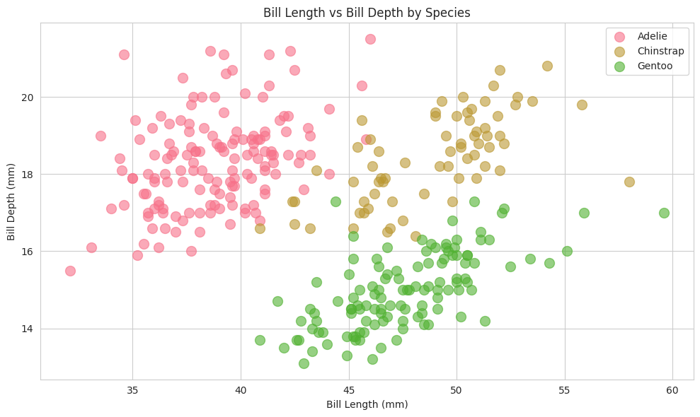

## 발견사항

- 세 종이 명확하게 구분됨
- **Adelie**: 부리가 짧고 깊은 경향
- **Gentoo**: 부리가 길고 얕은 경향
- **Chinstrap**: 중간 크기의 부리 특징

---

# 6. 산점도 분석 (2/2)

## 그래프 2 & 3: 체질량 관계 분석

### 그래프 2: 체질량 vs 부리 길이 (성별)

### 인사이트
- 수컷이 암컷보다 더 크고 무거움
- 선형 양의 상관관계 (r=0.59)
- 성별 이형성 명확함

---

# 7. 산점도 분석 (3/3)

## 그래프 3: 날개 길이 vs 체질량

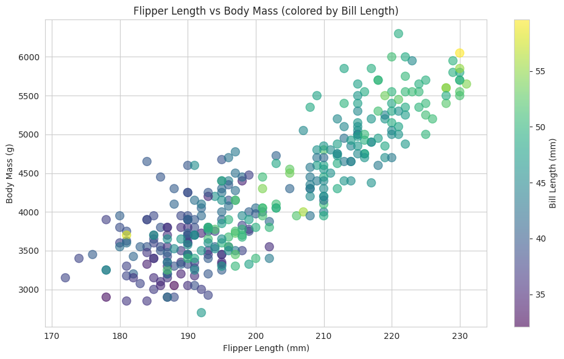

## 핵심 인사이트

- **가장 강한 상관관계**: r=0.87
- 신체 크기의 전반적 일관성
- 부리 길이로 색상 표시하여 3변수 관계 표현
- 종별 신체 구조의 일정성을 의미

---

# 8. 히스토그램 분석 (1/2)

## 그래프 4: 부리 길이 분포

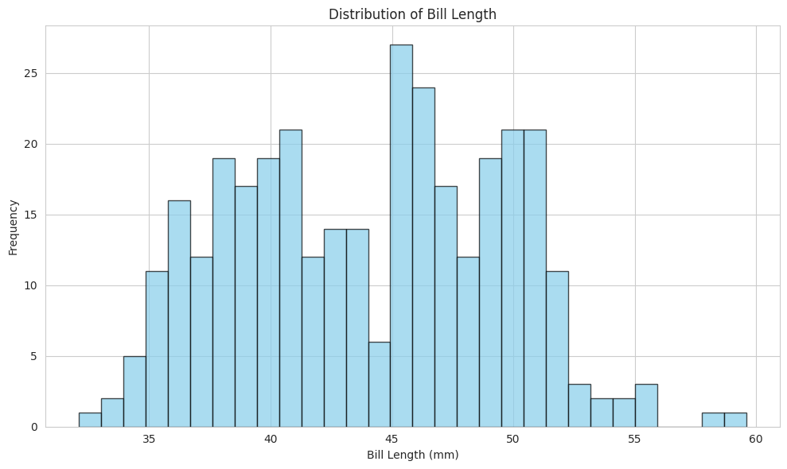

## 그래프 5: 부리 깊이 분포

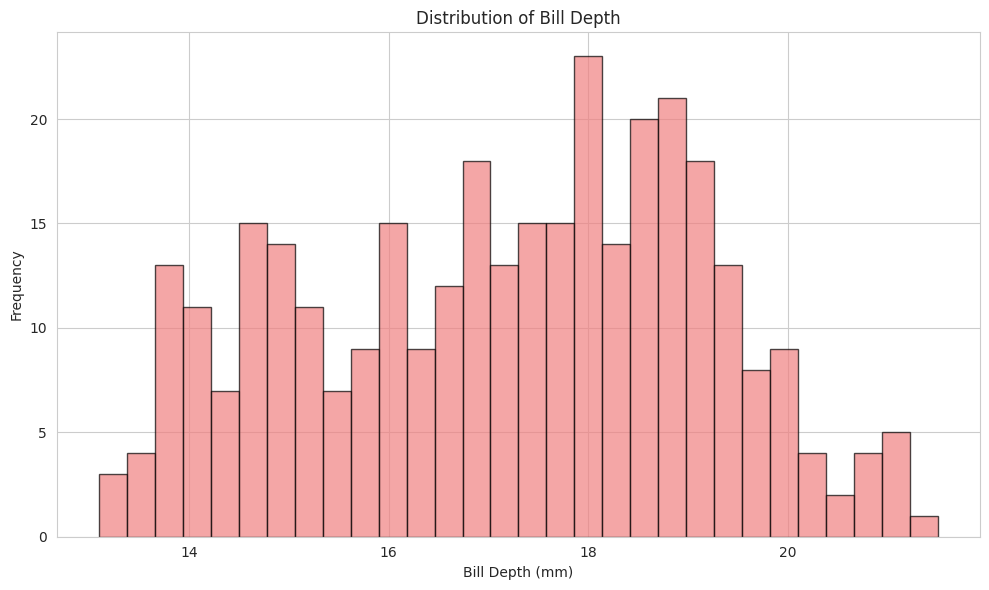

## 분석 결과

- 다봉분포(Multimodal) 패턴 → 종의 다양성 반영
- 부리 길이: 45mm 주변에서 가장 많은 관측
- 부리 깊이: 17-18mm에 집중분포

---

# 9. 히스토그램 분석 (2/2)

## 그래프 6: 날개 길이 분포

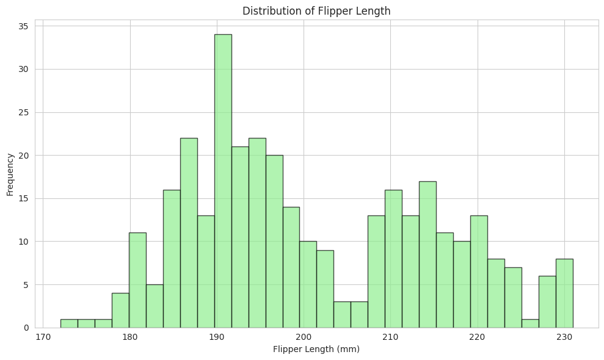

## 그래프 7: 체질량 분포

## 인사이트

- 모든 특성이 다봉분포를 보임
- 종별 신체 크기의 분명한 차이
- 각 종의 고유한 신체 특성을 반영

---

# 10. 박스플롯 분석

## 그래프 8 & 9: 종별 신체 특성 비교

### 그래프 8: 종별 부리 길이
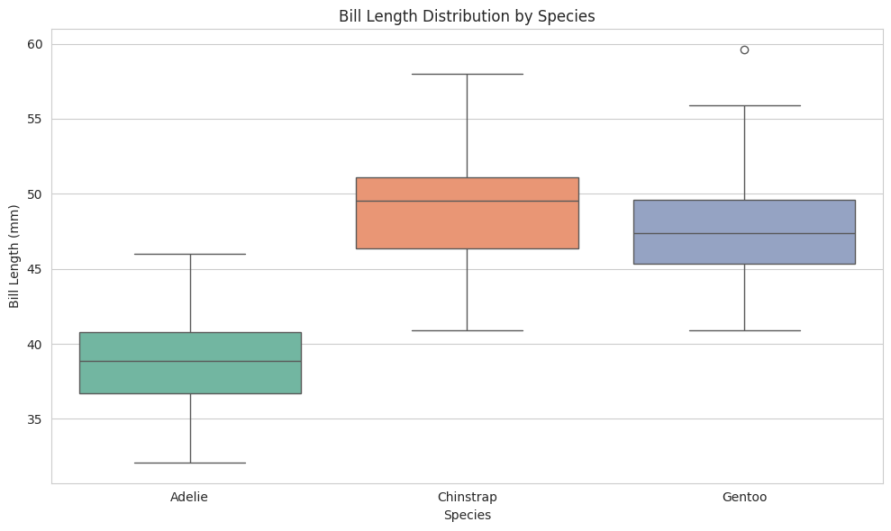

### 그래프 9: 종별 체질량
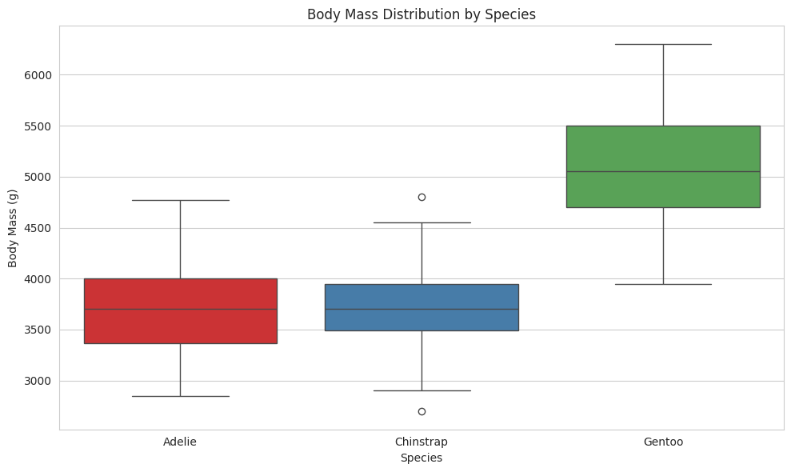

## 주요 발견

- **Gentoo**: 가장 크고 무거운 종
- **Adelie**: 중간 크기, 개인차 큼
- **Chinstrap**: 가장 작은 종
- 이상치(Outlier) 거의 없음 → 일관성 높음

---

# 11. 바이올린플롯 분석

## 그래프 10: 성별 부리 길이 분포

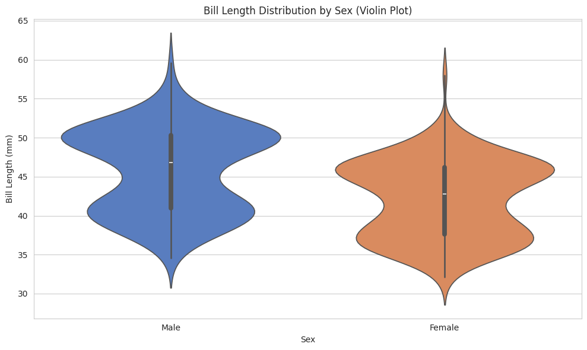

## 그래프 11: 종별/성별 체질량 분포

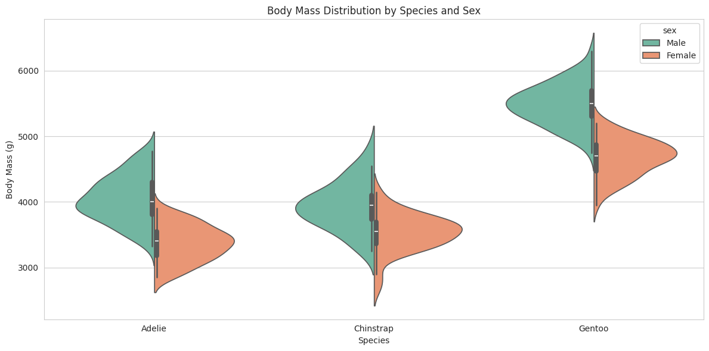

## 인사이트

- 수컷이 암컷보다 일관되게 큼 (3-9mm)
- 종과 성별의 상호작용 효과 명확
- **Gentoo 수컷**: 모든 그룹 중 가장 큼
- 성차(Sexual Dimorphism) 진화적 안정성 시사

---

# 12. 상관관계 분석

## 그래프 12: 상관관계 히트맵

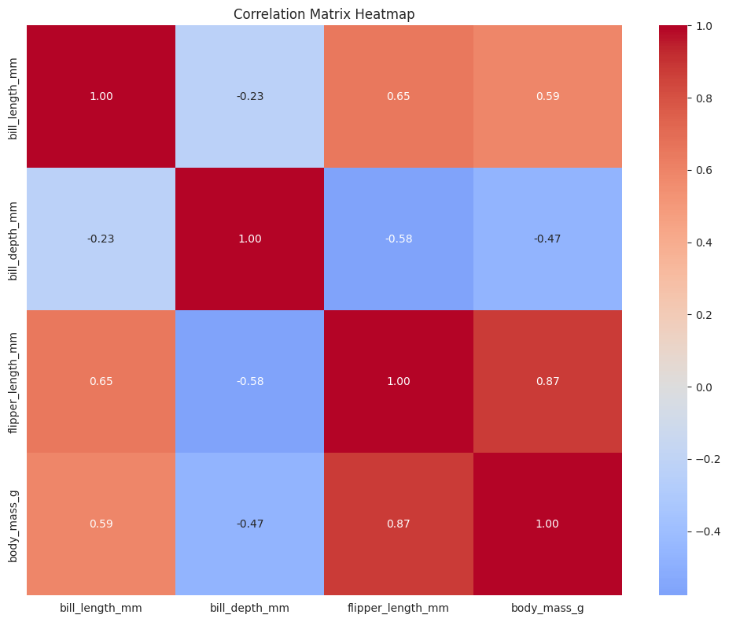

## 상관계수 해석

### 강한 양의 상관관계
- **날개 길이 ↔ 체질량**: r=0.87 (매우 강함)
- **부리 길이 ↔ 날개 길이**: r=0.65 (중간 강도)

### 음의 상관관계
- **부리 깊이 ↔ 체질량**: r=-0.47
- **부리 길이 ↔ 부리 깊이**: r=-0.23

## 생물학적 의미

- 신체 크기의 일관성
- 종별 고유한 부리 형태 적응
- 먹이 섭취 전략의 차이

---

# 13. 막대그래프 분석 (1/2)

## 그래프 13-15: 카테고리별 개체 수

### 그래프 13: 종별 개수
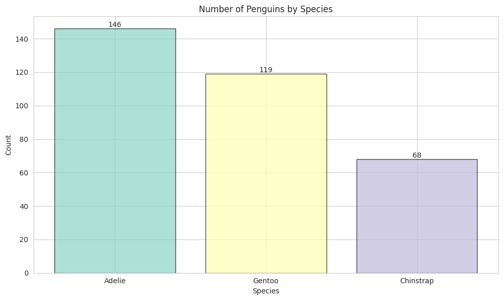

### 그래프 14: 성별 개수
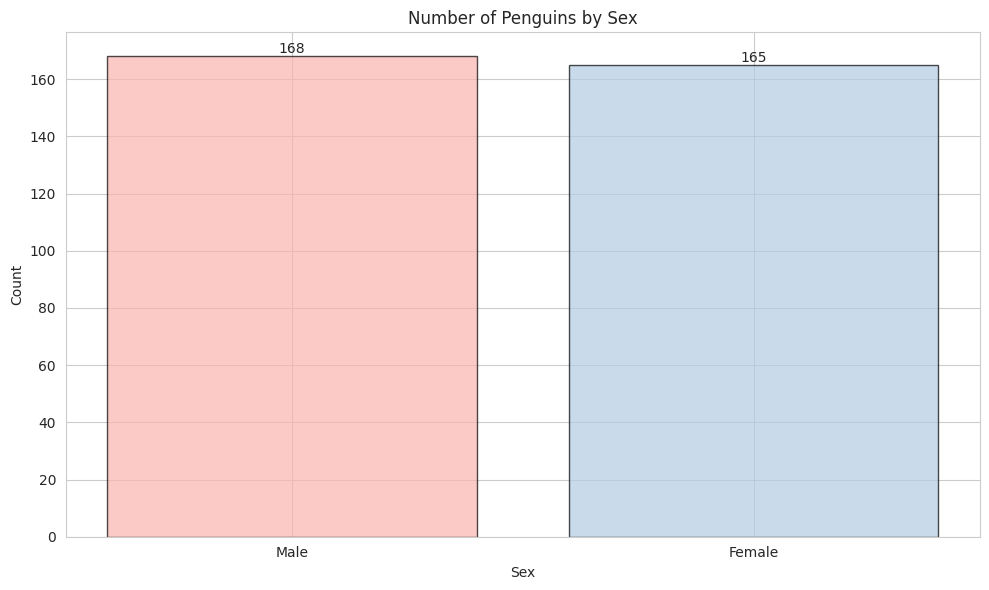

## 분석 결과

- **Adelie**: 146개 (표본 크기 충분)
- **Gentoo**: 119개 (분석 용이)
- **Chinstrap**: 68개 (표본 크기 주의)
- 성별 비율 균등 (168:165)

---

# 14. 막대그래프 분석 (2/2)

## 그래프 15: 섬별 개수

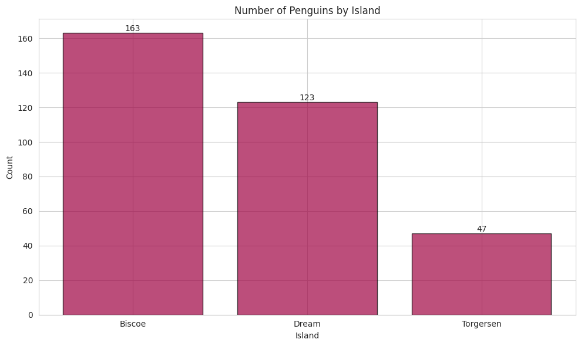

## 지역별 분포 특징

| 섬 | 개수 | 비율 |
|----|------|------|
| Biscoe | 163 | 48.9% |
| Dream | 123 | 36.9% |
| Torgersen | 47 | 14.1% |

## 인사이트

- 섬별 개체수 차이 존재
- Torgersen 표본 크기 제한적
- 지역별 격리(Geographic Isolation) 시사
- 섬별 생태계 차이 반영 가능

---

# 15. 추가 시각화 분석

## 그래프 16: 쌍플롯 (PairPlot)

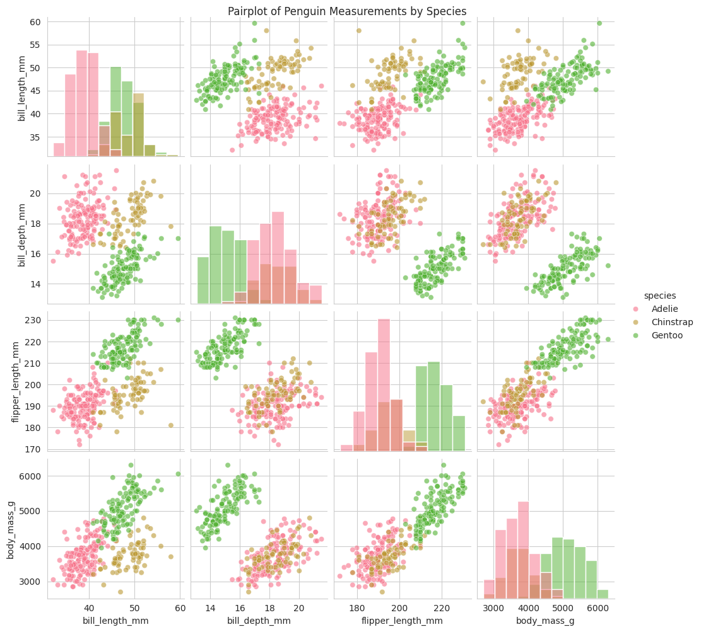

## 그래프 17 & 18: 카운트플롯

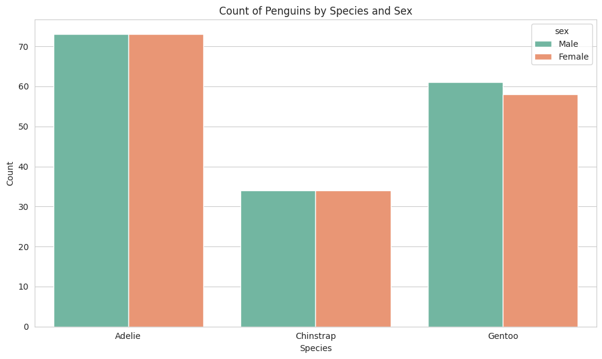

## 다변량 분석 인사이트

- 모든 변수 간 상호관계 시각화
- 종별 신체 특성 분명한 분리
- 성별 차이 일관된 패턴
- 예측 모델 구축 가능성 높음

---

# 16. 교차표 분석 (1/2)

## 종과 성별 교차표

| 종 | 수컷 | 암컷 | 합계 |
|-------|------|------|------|
| **Adelie** | 73 | 73 | 146 |
| **Chinstrap** | 34 | 34 | 68 |
| **Gentoo** | 61 | 58 | 119 |
| **합계** | 168 | 165 | 333 |

## 인사이트

- 모든 종에서 성별 비율 균등
- Adelie와 Chinstrap은 완벽한 1:1 비율
- 데이터 수집의 과학성 증명

---

# 17. 교차표 분석 (2/2)

## 종과 섬 교차표

| 종 | Biscoe | Dream | Torgersen | 합계 |
|-------|--------|-------|-----------|------|
| **Adelie** | 44 | 55 | 47 | 146 |
| **Chinstrap** | 0 | 68 | 0 | 68 |
| **Gentoo** | 119 | 0 | 0 | 119 |
| **합계** | 163 | 123 | 47 | 333 |

## 지역 격리 증거

- **Adelie**: 모든 섬에 분포 (적응력 우수)
- **Chinstrap**: Dream 섬 고유종
- **Gentoo**: Biscoe 섬 고유종
→ 진화적 지리적 격리의 증거

---

# 18. 피봇테이블 분석 (1/2)

## 종과 성별 피봇테이블 (평균 부리 길이)

| 종 | 암컷 | 수컷 | 평균 |
|-------|------|------|------|
| **Adelie** | 37.26 | 40.39 | 38.82 |
| **Chinstrap** | 46.57 | 51.09 | 48.83 |
| **Gentoo** | 45.56 | 49.47 | 47.57 |
| **평균** | 42.10 | 45.85 | 43.99 |

## 부리 길이의 종과 성별 차이

- **최대 차이**: Chinstrap 수컷(51.09mm) vs Adelie 암컷(37.26mm) = 13.83mm
- **성별 차이**: 수컷이 평균 3.75mm 더 길음
- **종별 차이**: 3.01mm 범위

## 종 구분의 최고 지표

✓ 단일 특성만으로도 종 구분 가능

---

# 19. 종합 인사이트

## 주요 발견사항 요약

1. **생물학적 특성의 명확한 분화**
   - 세 종이 신체 특성에서 뚜렷하게 구분
   - 부리 길이가 종 구분의 최고 지표

2. **성별 이형성의 일관성**
   - 모든 신체 특성에서 수컷이 3-9mm 더 큼
   - 비율은 종과 섬에 관계없이 일관됨

3. **지리적 격리의 명확한 증거**
   - 특정 종이 특정 섬에만 분포
   - Adelie만 모든 섬에 분포

4. **강한 신체 크기 상관성**
   - 날개 길이와 체질량 상관계수 0.87
   - 신체 비율의 진화적 안정성

---

# 20. 결론 및 활용 방안

## 분석의 의의

### 분류 및 식별
- 부리 길이 단일 특성으로 종 구분 가능
- 성별 판정에는 부리 깊이 또는 체질량 활용

### 보존 정책
- Chinstrap과 Gentoo는 서식지 특화 → 지역별 맞춤 보호
- Adelie는 적응력 높음 → 환경 변화 모니터링 필수

### 과학적 기여
- 펭귄 진화의 지리적 격리 증거
- 성별 이형성의 안정성 확인
- 기후 변화에 따른 개체군 모니터링 기준점 제공

## 향후 연구 방향
- 장기 추이 분석 (시계열 데이터)
- 환경 요인과의 상관관계 분석
- 기계학습을 활용한 종 분류 모델 개발
